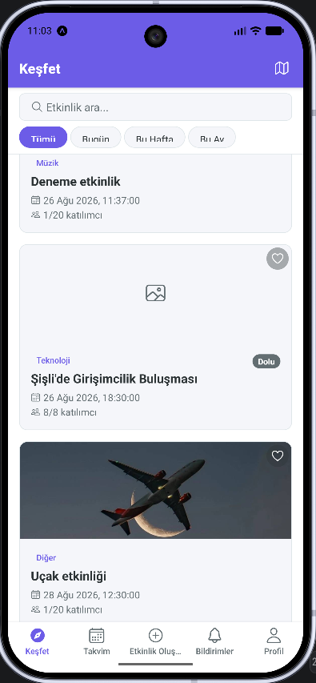
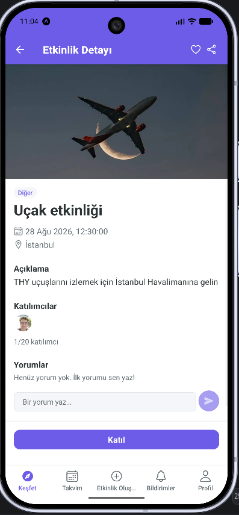
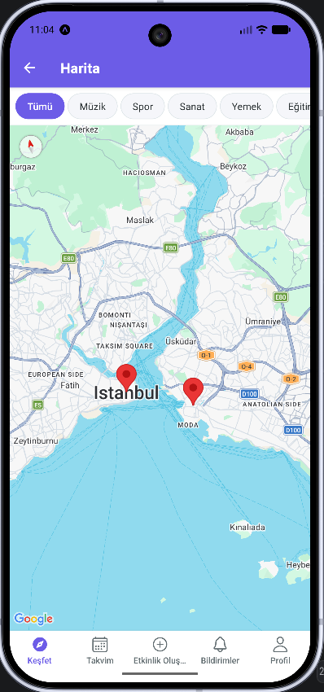
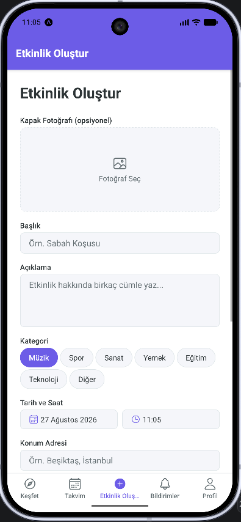
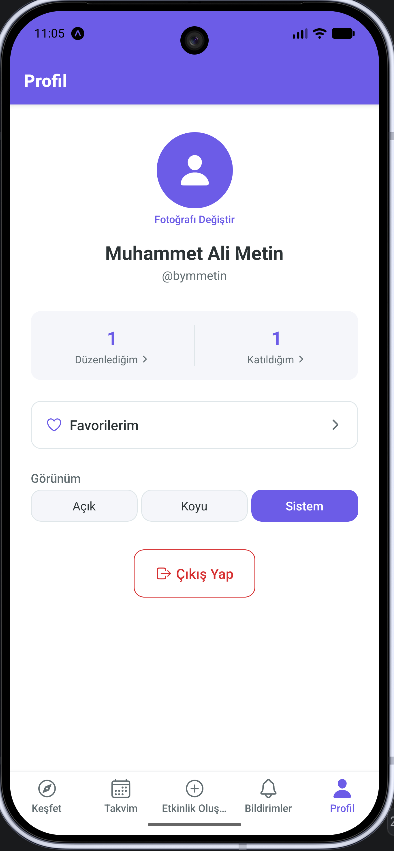
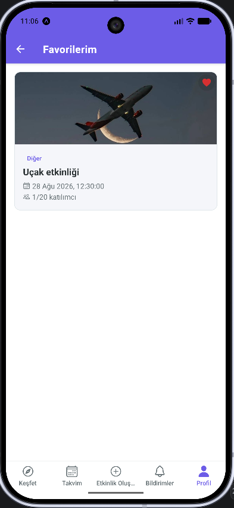

# Ne Yapsak

Etkinlik keşfetme, oluşturma ve katılım uygulaması. React Native + Expo + TypeScript + Supabase ile geliştirilmiştir.

<<<<<<< HEAD

=======

>>>>>>> 12113be6ad753f96c3b89b2e9047e1dd79b60ca9

> Bu proje, dijital oyun tasarımı bölümü zorunlu staj programı kapsamında geliştirilmiştir.

## Özellikler

- **Kimlik doğrulama** — kayıt, giriş, OTP kodu ile şifre sıfırlama
- **Misafir erişimi** — giriş yapmadan etkinlikleri, haritayı ve yorumları görüntüleme; katılma/yorum/favorileme/oluşturma gibi işlemler girişi gerektirir
- **Etkinlik yönetimi** — oluşturma, düzenleme, iptal (yalnızca organizatör, RLS ile korunur), kapak fotoğrafı yükleme
- **Katılım** — etkinliğe katılma, kapasite dolunca bekleme listesi
- **Harita** — etkinlikleri pin olarak gösterme, kümeleme, kategori filtresi
- **Arama ve filtreleme** — başlık/açıklamada arama, tarih aralığı filtresi
- **Bildirimler** — etkinlik öncesi ve değerlendirme daveti için yerel bildirimler
- **Gerçek zamanlı** — Supabase Realtime ile anlık katılımcı sayısı ve yorum akışı
- **Yorumlar** — şikayet etme ve engelleme temel akışı dahil
- **Favoriler** ve **1-5 yıldız + yorum ile değerlendirme**
- Karanlık / aydınlık tema

## Teknoloji Yığını

| Katman | Teknoloji |
|---|---|
| Uygulama | React Native, Expo SDK 54 (managed workflow), TypeScript (strict mode) |
| Navigasyon | React Navigation (native-stack + bottom-tabs) |
| Backend | Supabase (PostgreSQL, Row Level Security, Auth, Storage, Realtime) |
| Form / Validasyon | react-hook-form + Zod |
| Cihaz özellikleri | expo-image-picker, expo-location, react-native-maps, expo-notifications |
| Test | Jest |
| CI | GitHub Actions |

## Kurulum

```bash
git clone https://github.com/bymmetin/ne_yapsak.git
cd ne_yapsak
npm install
cp .env.example .env
```

`.env` dosyasını kendi Supabase proje bilgilerinle doldur:

```
EXPO_PUBLIC_SUPABASE_URL=...
EXPO_PUBLIC_SUPABASE_ANON_KEY=...
```

Uygulamayı başlat:

```bash
npx expo start
```

## Test ve Kod Kalitesi

```bash
npx tsc --noEmit   # tip kontrolü
npm run lint       # ESLint
npm test           # Jest birim testleri
```

Bu üç adım, `main` dalına yapılan her push ve pull request'te GitHub Actions ile otomatik olarak çalışır (bkz. `.github/workflows/ci.yml`).

## Ekran Görüntüleri

> Aşağıdaki görselleri `docs/screenshots/` klasörüne ekleyip yolları güncelle.

| Misafir modunda Keşfet | Etkinlik Detay | Harita |
|---|---|---|
|  |  |  |

| Etkinlik Oluşturma | Profil | Favoriler |
|---|---|---|
|  |  |  |

## Bilinen Kısıtlamalar

- **Kontrast:** Karanlık modda "Dolu" rozeti ve `primary`/`error` metin renkleri WCAG AA kontrast eşiğinin altında kalıyor. Marka renklerinin temalar arasında sabit tutulması bilinçli bir tasarım tercihidir, düzeltilmemiştir.
- **Uzaktan (remote) push bildirimleri kapsam dışıdır.** Expo Go, SDK 53'ten itibaren uzaktan push desteğini kaldırdı; yalnızca yerel bildirimler çalışır.
- Bir etkinlik iptal edildiğinde veya ertelendiğinde yalnızca işlemi yapan kullanıcının kendi yerel hatırlatmaları güncellenir; diğer katılımcıların bildirimleri değişmez (bu, uzak push altyapısı gerektirir).
- Bekleme listesindeki kullanıcının kapasite boşalınca otomatik onaylanması henüz uygulanmamıştır.
- Google ile giriş (OAuth) yapılandırılmamıştır (Google Cloud Console kurulumu kapsam dışı bırakılmıştır).
- E-posta doğrulama linkinden sonra uygulamaya otomatik dönüş çalışmamaktadır; hesap sunucu tarafında onaylanır, kullanıcı bir kez elle giriş yapmalıdır.

## Lisans

Bu proje eğitim/staj amaçlı geliştirilmiştir.
